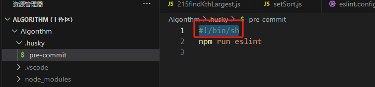

# git 提交时报错`error: cannot spawn .husky/pre-commit: No such file or directory`

**原因**：配置的 husky 中，pre-commit 文件开头缺少一行代码`#!/bin/sh`
</br>
**联想**：第一行的作用是什么?</br>
`#!` 是一个约定的标记，它告诉系统这个脚本需要什么解释器来执行，即使用哪一种 Shell。</br>
如果通过手动执行则不需要添加第一行，如：

```sh
/bin/sh test.sh
/bin/php test.php
```
