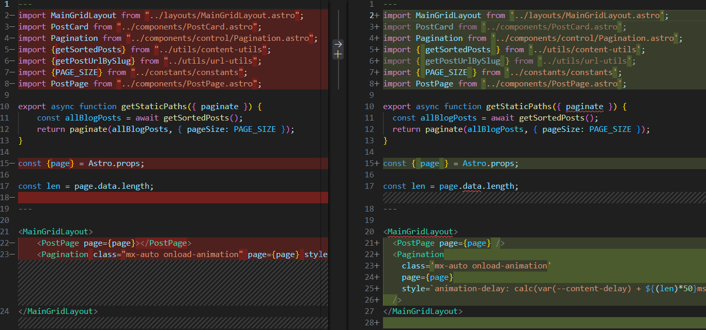

# 1 统一代码风格的重要性

随着团队项目中代码数量的增长，项目成员不一致的编程风格，容易出现代码提交 diff 难以辨识的问题。今天这个同学在格式化代码时用的是 2 格缩进，明天另一个同学提交代码时用了 4 格缩进后，出现了一堆非业务代码的修改变更。导致在做 Code Review 时难以辨识真正的业务代码。

接下来本文通过 ESLint+Prettier+husky+lint-staged 构建一套覆盖开发到提交的前端项目 JS 代码规范脚手架。</br>
首先通过以下指令创建一个项目，后续的所有配置将在这个 demo 下运行

```shell
 mkdir eslint-config-demo
 cd ./eslint-config-demo
 npm init
 git init
```

# 2 Eslint

## 2.1 什么是 ESLint

ESLint 是一种用于识别和报告符合 ECMAScript/JavaScript 模式代码的工具，目的是使代码更加一致并避免错误。

ESLint 是完全插件化的。每条规则都是一个插件，可以在运行时添加更多插件。还可以添加社区插件、配置和解析器来扩展 ESLint 的功能。

我们可以直接使用开源的配置方案，例如 eslint-config-airbnb 或 eslint-config-standard。如下：

```shell
npm init @eslint/config@latest
```

如果是已有项目则可以手动安装 ESLint 并配置。

## 2.2 安装 ESLint

1. 在项目中安装 ESLint 包，其中@eslint/js 就是一种 js 语法检查插件

```
npm install --save-dev eslint @eslint/js
```

2. 添加 eslint.config.js 文件

```
touch eslint.config.js
```

3. 向文件添加配置 eslint.config.js。

```javascript
import js from '@eslint/js';

export default [
  js.configs.recommended,

  {
    rules: {
      'no-unused-vars': 'warn',
      'no-undef': 'warn',
    },
  },
];
```

4. 使用 ESLint 测试代码

[命令行使用方法](https://eslint.org/docs/latest/use/command-line-interface)

```
npx eslint src/**
```

5. [更多扩展配置...](https://eslint.org/docs/latest/use/configure/)

## 2.3 ESLint 核心原理

ESLint 是通过静态分析实现语言检查，需要构建一个预编译过程。 其核心代码都在[linter 类](https://github.com/eslint/eslint/blob/4bcdfd07d514fd7a6b8672d33703d0b6c606f214/lib/linter.js#L770)中。主要核心步骤为一下几个：</br>

1. 预处理： preprocess ，将源码转换为代码块数组。[源码](https://github.com/eslint/eslint/blob/4bcdfd07d514fd7a6b8672d33703d0b6c606f214/lib/linter.js#L939)
2. 解析： parser 解析代码为 AST ，默认 parser 为 Espree ，生成 SourceCode。[源码](https://github.com/eslint/eslint/blob/4bcdfd07d514fd7a6b8672d33703d0b6c606f214/lib/linter.js#L842)
3. 检查： 遍历 AST ，应用 rule ，生成 lintingProblems。[源码](https://github.com/eslint/eslint/blob/4bcdfd07d514fd7a6b8672d33703d0b6c606f214/lib/linter.js#L891)
4. 过滤： 通过 commentDirectives.disableDirectives 过滤 lintingProblems。[源码](https://github.com/eslint/eslint/blob/4bcdfd07d514fd7a6b8672d33703d0b6c606f214/lib/linter.js#L909)
5. 后处理： postprocess ，针对 lintingProblems 进行处理。[源码](https://github.com/eslint/eslint/blob/4bcdfd07d514fd7a6b8672d33703d0b6c606f214/lib/linter.js#L939)

# 3 Prettier

## 3.1 什么是 Prettier

Prettier 的中文意思是“漂亮的、机灵的”，也是一个流行的代码格式化工具的名称，它能够解析代码，使用你自己设定的规则来重新打印出格式规范的代码。

## 3.2 安装 Prettier

1. 本地安装

```shell
npm install --save-dev --save-exact prettier
```

2. 创建配置文件

```shell
# 创建格式化规则配置
node --eval "fs.writeFileSync('.prettierrc','{}\n')"
# 创建忽略配置
node --eval "fs.writeFileSync('.prettierignore','# Ignore artifacts:\nbuild\ncoverage\n')"
```

```json
// .prettierrc
{
  "printWidth": 150,
  "tabWidth": 2,
  "useTabs": false,
  "semi": true,
  "singleQuote": true,
  "bracketSpacing": true,
  "arrowParens": "avoid"
}
```

3. 测试 prettier

```shell
npx prettier . --write
```

4. [更多配置...](https://prettier.io/docs/en/options)

# 4 Husky

## 4.1 Husky 是什么

Husky 是一个工具，它允许我们轻松地处理 Git Hooks 并在提交代码时运行我们想要的脚本。

## 4.2 安装 Husky

1. 安装脚本

```shell
npm install --save-dev husky
npx husky init
```

如果我们要在代码提交阶段，进行代码规范检查及修正，就需要在 pre-commit 中调用 eslint 及 prettier。

2. 在 .husky 中创建 pre-commit

```shell
node --eval "fs.writeFileSync('.husky/pre-commit','npx eslint src/**\n npx prettier --write ./src\n
git add .')"
```

3. 测试 pre-commit</br>

提交前：


提交后：


可以看到当提交后，首先 eslint 进行了代码检查，然后 prettier 进行了风格统一化并保存。但是这里存在一个问题，每次提交都会将所有代码扫描一遍，在工程复杂的情况下，提交性能很差。因此需要通过 lint-staged 解决。

# 5 Lint-staged

## 5.1 Lint-staged 是什么

lint-staged 是一个在 git 暂存文件上运行 linter 的工具

## 5.2 安装 Lint-staged

1. 安装脚本

```shell
npm install --save-dev lint-staged # requires further setup
```

2. 配置，[更多配置...](https://github.com/lint-staged/lint-staged?tab=readme-ov-file#configuration)

```json
{
  "lint-staged": {
    "src/**/*.{tsx,js}": ["eslint --fix", "prettier --write --ignore-unknown"]
  }
}
```

3. 修改 pre-commit 为

```shell
#!/bin/sh
npx lint-staged
```

# 6 效果测试

- indexA.js：</br>
  
- indexB.js：</br>
  
- 暂存区：只添加 indexB.js</br>
  
- 提交：</br>
  
  

最终提交后只修改并提交 indeB.js，而 indexA.js 没有被修改。

# 7 总结

至此 JS 代码规范就全部完成，更多配置可根据文中链接自行添加。</br>
本文所产出的脚手架已全部提交至 [GitHub](https://github.com/AKLelouch/eslint-config-prettier-demo) 中。</br>
后续可以基于该脚手架快速搭建一个前端项目。
