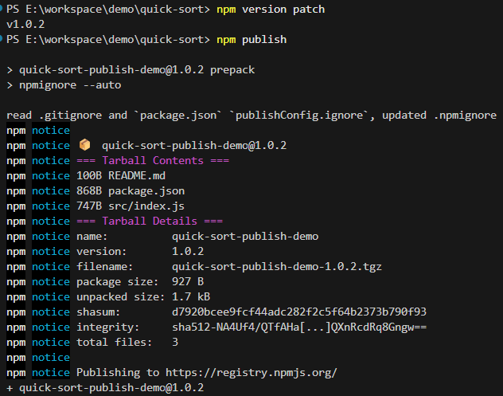
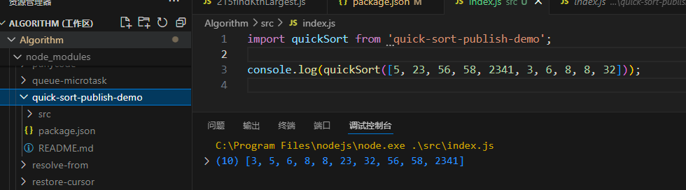

[上一节](https://aklelouch.cn/posts/2025-01/20250111-01/%E5%89%8D%E7%AB%AF%E5%B7%A5%E7%A8%8B%E5%8C%96%E4%B9%8Bjs%E4%BB%A3%E7%A0%81%E8%A7%84%E8%8C%83/)我们完成了前端工程化的代码规范部分。这节我们将学习，如何将开发的脚手架、组件库以及工具包等项目发布至 npm，以供其他开发人员使用。

本节项目[以此](https://github.com/AKLelouch/quick-sort-publish-demo)为例。

# 1 配置.npmignore

项目中有一些不需要发布的文件，可以通过配置.npmignore 配置忽略。

```shell
# npm
node_modules

# dev
eslint.config.js
.eslintignore
.prettierrc
.prettierignore
.gitignore

#other
.husky
```

同时，还可以通过 npmignore 包来自动生成.npmignore 文件。首先运行 `npm install --save-dev npmignore`。

在.gitignore 文件中添加 .npmignore 文件以便.npmignore 文件不再提交到版本控制。
在 package.json 中，将以下 JSON 添加到“scripts”和“publishConfig”：

```json

  "scripts": {
    "prepack": "npmignore --auto"
  },
  "publishConfig": {
    "ignore": [
      "eslint.config.js",
      ".eslintignore",
      ".prettierrc",
      ".prettierignore",
      ".gitignore",
      ".husky"
    ]
  }
```

在后续每当运行 npm pack 或时 npm publish，npmignore 都会自动创建一个.npmignore 文件:

```shell
# Rules from: E:\workspace\demo\eslint-demo\.gitignore

node_modules

.npmignore
package-lock.json

# npmignore - content above this line is automatically generated and modifications may be omitted
# see npmjs.com/npmignore for more details.
eslint.config.js
.eslintignore
.prettierrc
.prettierignore
.gitignore
.husky

```

# 2 发布前准备工作

1. 在[npm 官网](https://www.npmjs.com/)注册一个自己的 npm 账号。

2. [npm 官网](https://www.npmjs.com/)检查包名是否重复。搜索包名即可。

3. 发布包版本管理。发布之前要提前更新发布包的版本号。版本号分三类，主版本号(major). 次版本号(minor). 修订号(patch)。

```shell
# 主版本号：主要是大版本的迭代；1.0.0升级到2.0.0
npm version major

# 次版本号: 向下兼容的功能性新增, 对应小版本迭代；2.0.0升级到2.1.0，2.2.0
npm version minor

# 修订号: 向下兼容的问题修复,对应修正版本迭代；2.2.0升级到2.2.1
npm version patch
```

# 3 发布包

1. `nrm ls` 或者 `nrm current` 检查当前源，若不是 npm 官方源，则使用用`npm use npm`切换。
2. `npm login` 登录。
3. `npm publish` 打包发布。



# 4 验证包

1. 官网查看包是否存在
2. 在项目中引入并使用，`npm i quick-sort-publish-demo`



# 4 总结

本文主要展示了一个 npm 项目的发布流程。
文中项目链接已上传[github](https://github.com/AKLelouch/quick-sort-publish-demo)。
