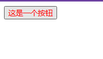
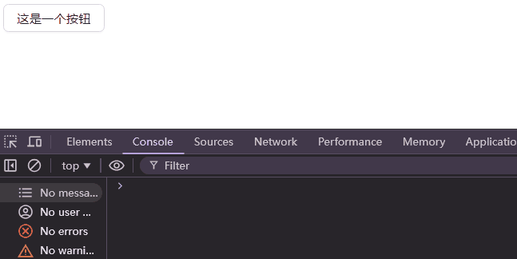

在工作过程中开发低代码平台时，涉及到封装组件库给引擎引入。从零封装一套组件库是一个费力不讨好的工作，因此考虑使用 AntD 封装。

# 目标

1. React 组件库，取名 x-components，导出 x-components.umd.js、x-components.umd.css。
2. 组件逻辑使用 TypeScript 开发。
3. 组件样式使用 less 开发。
4. 组件使用 webpack 作为打包工具。
5. React 及 React-Dom 模块使用外部引入。

# 项目构建

## 整体技术选型

1. 使用 yarn 作为包管理工具
2. 使用 webpack 作为打包工具
3. 使用 babel 处理 TypeScript 代码 3.使用 less-loader、css-loader 等处理样式代码，使用 MiniCssExtractPlugin 分离 CSS

## 项目初始化

### 初始化 x-components 项目

可参考[前端工程化系列](https://aklelouch.cn/archive/category/%E5%89%8D%E7%AB%AF%E5%B7%A5%E7%A8%8B%E5%8C%96/)

目录结构

```
x-components\src
│  index.ts
│
├─components
│  ├─x-button
│  │      index.tsx
│  │
│  └─x-input
│          index.tsx
│   ....
```

### 安装 webpack

在本地安装 webpack，接着安装 webpack-cli（此工具用于在命令行中运行 webpack）：

```shell
yarn add -D webpack webpack-cli
```

### 添加配置文件 webpack.config.js

```javascript
const path = require('path');

module.exports = {
  entry: './src/index.ts',
  output: {
    filename: 'x-components.umd.js', // 打包后的文件名
    path: path.resolve(__dirname, 'dist'), // 打包后的文件目录：根目录/dist/
    library: 'xcomponents', // 导出的UMD js会在window挂xcomponents，即可以访问window.xcomponents
    libraryTarget: 'umd', // 导出库为UMD形式
  },
  resolve: {
    // webpack 默认只处理js、jsx等js代码
    extensions: ['.js', '.jsx', '.ts', '.tsx'],
  },
};
```

### 引入 Babel

引入 babel-loader 以及相关 babel 库

```shell
yarn add -D babel-loader @babel/core @babel/preset-env @babel/preset-typescript @babel/preset-react @babel/plugin-proposal-class-properties @babel/plugin-proposal-object-rest-spread
```

```diff
# diff --git a/package.json b/package.json
@@ -11,6 +12,13 @@
     "prepack": "npmignore --auto"
   },
   "devDependencies": {
+    "@babel/core": "^7.26.7",
+    "@babel/plugin-proposal-class-properties": "^7.18.6",
+    "@babel/plugin-proposal-object-rest-spread": "^7.20.7",
+    "@babel/preset-env": "^7.26.7",
+    "@babel/preset-react": "^7.26.3",
+    "@babel/preset-typescript": "^7.26.0",
+    "babel-loader": "^9.2.1",
     "@eslint/js": "^9.18.0",
     "eslint": "^9.18.0",
     "husky": "^9.1.7",
```

#### Babel 原理

看到上面一长串依赖，一开始可能会有点手足无措，不知道这么多东西是干啥的。可以通过[这篇文章](https://zhuanlan.zhihu.com/p/43249121)了解到 babel 到底是做什么的。文章比较长，这里简单做个总结。

> babel 总共分为三个阶段：解析，转换，生成。</br>
> babel 本身不具有任何转化功能，它把转化的功能都分解到一个个 plugin 里面。因此当我们不配置任何插件时，经过 babel 的代码和输入是相同的。</br>
> 插件总共分为两种：
>
> - **语法插件**：用于解析这一步，将代码转换为 AST。当我们添加 **语法插件** 之后，在解析这一步就使得 babel 能够解析更多的语法。(顺带一提，babel 内部使用的解析类库叫做 babylon，并非 babel 自行开发)</br>
>
> 举个简单的例子，当我们定义或者调用方法时，最后一个参数之后是不允许增加逗号的，如 callFoo(param1, param2,) 就是非法的。如果源码是这种写法，经过 babel 之后就会提示语法错误。但最近的 JS 提案中已经允许了这种新的写法(让代码 diff 更加清晰)。为了避免 babel 报错，就需要增加语法插件 babel-plugin-syntax-trailing-function-commas。
>
> - **转译插件**：用于转换这一步，将 AST 转换为能够执行的目标代码。当我们添加 转译插件 之后，在转换这一步把源码转换并输出。这也是我们使用 babel 最本质的需求。
>
> 比起语法插件，转译插件其实更好理解，比如箭头函数 (a) => a 就会转化为 function (a) {return a}。完成这个工作的插件叫做 babel-plugin-transform-es2015-arrow-functions。
>
> 同一类语法可能同时存在 **语法插件** 版本和 **转译插件** 版本，只需要选其一即可。

因为 babel 的插件处理的力度很细，所以 babel 提出，将一堆插件组合成一个 preset（预置插件包），这样，我们只需要引入一个插件组合包，就能处理代码的各种语法、语义。

- @babel/core，babel 的核心模块，实现了上述的流程运转以及代码语法、语义分析的功能。

- @babel/plugin-proposal-class-properties（允许类具有属性）和@babel/plugin-proposal-object-rest-spread（对象展开），plugin 开头代表插件，其实**这两个插件的功能都已经并入了 ES 规范，且包含在 @babel/preset-env 中**，不需要再额外引入了，这里引入只是为了作为例子。

- @babel/preset-typescript，会处理所有 ts 的代码的语法和语义规则，并转换为 js 代码；

- @babel/preset-react，故名思义，可以帮助处理使用 React 相关特性，例如 JSX 标签语法的转译等。

#### webpack 的基于 babel-loader 的处理流程

我们解释了这么多包，还剩一个 babel-loader 还没有说。这个包就是连接 webpack 和 babel 的桥梁。我们通过配置 webpack.config.js，即可通过 webpack 使用 babel。

```diff
diff --git a/webpack.config.js b/webpack.config.js
index 2d68725..8931a9f 100644
--- a/webpack.config.js
+++ b/webpack.config.js
@@ -12,4 +12,13 @@ module.exports = {
     // webpack 默认只处理js、jsx等js代码
     extensions: ['.js', '.jsx', '.ts', '.tsx'],
   },
+  module: {
+    rules: [
+      {
+        test: /\.tsx?$/,
+        use: 'babel-loader',
+        exclude: /node_modules/,
+      },
+    ],
+  },
 };
```

这一步配置的意思是，在遇到以.ts、.tsx 结尾的文件时，将代码交给 babel-loader 解析。babel-loader 将代码交给内部引用的 @babel/core 进行相关处理。同时，为防止 webpack 解析依赖库，将 node_modules 排除。

而 @babel/core 是通过什么知道，我们想要的解析配置呢。和许多其他工具类似，配置文件：ESLint (.eslintrc)、Prettier (.prettierrc)。这里就需要通过 babel 的配置文件获得。

```json
{
  "presets": [
    "@babel/preset-env",
    "@babel/preset-typescript",
    "@babel/preset-react"
  ],
  "plugins": [
    "@babel/plugin-proposal-class-properties",
    "@babel/plugin-proposal-object-rest-spread"
  ]
}
```

#### 总结

webpack 中 babel 的工作流程：

1. \*\*.ts(x)文件交给 webpack 打包
2. webpack 将\*\*.ts(x)文件交给 babel-loader
3. babel-loader 将其交给@babel/core
4. @babel/core 根据配置文件进行解析转换为 js 代码

### React 通过外部引入

那么为什么需要将 React 通过外部引入呢？

这是因为，作为一个组件库，通常需要在另一个项目中被引用，而在这个项目中可能已经引用过 React 库，因此为避免代码重复打包，影响页面性能，因此将 React 排除。

#### 首先通过 webpack 配置 externals

```diff
diff --git a/webpack.config.js b/webpack.config.js
index 8931a9f..9c43162 100644
--- a/webpack.config.js
+++ b/webpack.config.js
@@ -12,6 +12,11 @@ module.exports = {
     // webpack 默认只处理js、jsx等js代码
     extensions: ['.js', '.jsx', '.ts', '.tsx'],
   },
+  externals: {
+    // 打包过程遇到以下依赖导入，不会打包对应库代码，而是调用window上的React和ReactDOM
+    react: 'React',
+    'react-dom': 'ReactDOM',
+  },
   module: {
     rules: [
```

#### Html 中添加 React 及 React-DOm 的 CDN 链接

```html
<script src="https://unpkg.com/react@18.3.1/umd/react.development.js"></script>
<script src="https://unpkg.com/react-dom@18.3.1/umd/react-dom.development.js"></script>

<!--需要注意文件路径-->
<script defer src="x-components.umd.js"></script>
```

#### 项目的开发依赖中引入 React 及 React-Dom

当我们将 react 排除打包了之后，只需要通过开发依赖引入 react 即可。

```shell
yarn add -D @types/react@18.3.1 @types/react-dom@18.3.1
```

```diff
diff --git a/package.json b/package.json
index d071181..b0489ab 100644
--- a/package.json
+++ b/package.json
@@ -18,6 +18,8 @@
     "@babel/preset-env": "^7.26.7",
     "@babel/preset-react": "^7.26.3",
     "@babel/preset-typescript": "^7.26.0",
+    "@types/react": "18.3.1",
+    "@types/react-dom": "18.3.1",
     "babel-loader": "^9.2.1",
     "@eslint/js": "^9.18.0",
     "eslint": "^9.18.0",
```

现在我们完成了 typescript 及 webpack 的打包。

接下来我们开始编写组件

# 组件编写

## 创建 Button 组件

我们先手写一个 button 组件并导出，以测试 webpack

```tsx
// x-components\src\components\x-button\index.tsx
import React from 'react';

const Button = (props) => {
  const { children, ...rest } = props;

  return <button {...rest}>{children}</button>;
};

export default Button;
```

再通过 src/index.ts 导出

```ts
export { default as Button } from './components/x-button';
```

在 html 中编写测试代码

```html
<body>
  <div id="root"></div>
  <script>
    const onClick = () => {
      alert('按钮被点击');
    };

    const rootElement = document.getElementById('root');

    const root = ReactDOM.createRoot(rootElement);

    // 前面我们在webpack中用xcomponents名导出了组件，这里可以通过window直接使用
    const button = React.createElement(
      xcomponents.Button,
      { onClick },
      '这是一个按钮'
    );
    root.render(button);
  </script>
</body>
```

效果


## 导出样式

现在我们有了自己的组件，但是还没有样式。

我们需要编写 less 样式，

```less
// x-components\src\components\x-button\index.less

.button {
  color: red;
}
```

### 在 button 中引入

```diff
diff --git a/src/components/x-button/index.tsx b/src/components/x-button/index.tsx
index 434e446..0cef070 100644
--- a/src/components/x-button/index.tsx
+++ b/src/components/x-button/index.tsx
@@ -1,9 +1,10 @@
 import React from 'react';
+import './index.less';

 const Button = props => {
   const { children, ...rest } = props;

-  return <button {...rest}>{children}</button>;
+  return <button {...rest} className='button'>{children}</button>;
 };

 export default Button;
```

### 通过 webpack 导出单独的样式文件。

其主要有一下几个步骤：

- 引入 less。用于编译 less 为 css。
- 引入 less-loader。用于链接 webpack 和 less 编译器。
- 引入 css-loader。要想在 JavaScript 模块中导入 css 文件，需要安装 css-loader。
- 引入 mini-css-extract-plugin， 用于压缩 css 代码，并将其单独打包输出。

```shell
yarn add -D less less-loader css-loader mini-css-extract-plugin
```

```diff
diff --git a/package.json b/package.json
index 92beb57..4c49e00 100644
--- a/package.json
+++ b/package.json
@@ -22,9 +22,13 @@
     "@types/react": "18.3.1",
     "@types/react-dom": "18.3.1",
     "babel-loader": "^9.2.1",
+    "css-loader": "^7.1.2",
     "eslint": "^9.18.0",
     "husky": "^9.1.7",
+    "less": "^4.2.2",
+    "less-loader": "^12.2.0",
     "lint-staged": "^15.3.0",
+    "mini-css-extract-plugin": "^2.9.2",
     "npmignore": "^0.3.1",
     "prettier": "3.4.2",
     "webpack": "^5.97.1"
```

配置 webpack

```diff
diff --git a/webpack.config.js b/webpack.config.js
index 6ae56ad..0cb2d36 100644
--- a/webpack.config.js
+++ b/webpack.config.js
@@ -1,5 +1,7 @@
const path = require('path');

+const MiniCssExtractPlugin = require('mini-css-extract-plugin');
+
module.exports = {
  entry: './src/index.ts',
  output: {
@@ -24,6 +26,15 @@ module.exports = {
        use: 'babel-loader',
        exclude: /node_modules/,
      },
+      {
+        test: /\.less$/,
+        use: [MiniCssExtractPlugin.loader, 'css-loader', 'less-loader'],
+      },
    ],
  },
```

### 效果测试

html 中引入 css 文件

```html
<script src="../dist/x-components.umd.js"></script>
<link href="../dist/x-components.umd.css" rel="stylesheet" />
```



可以看到现在按钮已经有了样式

# 引入 AntD

现在将 AntD 引入，并替换原来的组件。

这里已经不需要将 AntD 的样式单独引入了。

```shell
yarn add antd
```

```diff
diff --git a/src/components/x-button/index.tsx b/src/components/x-button/index.tsx
index 0cef070..2f8284c 100644
--- a/src/components/x-button/index.tsx
+++ b/src/components/x-button/index.tsx
@@ -1,10 +1,13 @@
 import React from 'react';
+import { default as AntDButton, ButtonProps as AntDButtonProps } from 'antd/es/button';
 import './index.less';

-const Button = props => {
+interface ButtonProps extends AntDButtonProps {}
+
+const Button: React.FC<ButtonProps> = props => {
   const { children, ...rest } = props;

-  return <button {...rest} className='button'>{children}</button>;
+  return <AntDButton {...rest}>{children}</AntDButton>;
 };

 export default Button;
```

## 效果测试

重新打包后：



# 写在最后

本文至此全部结束，我们基于 React、TypeScript，封装 AntD 组件库，并通过 Webpack、babel 等将其打包输出。</br>
所有代码均已提交至 [github](https://github.com/AKLelouch/x-components)。
