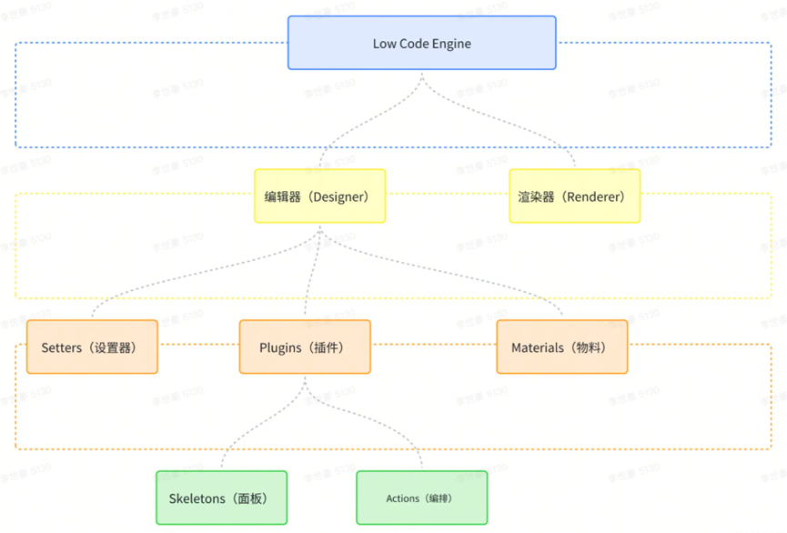
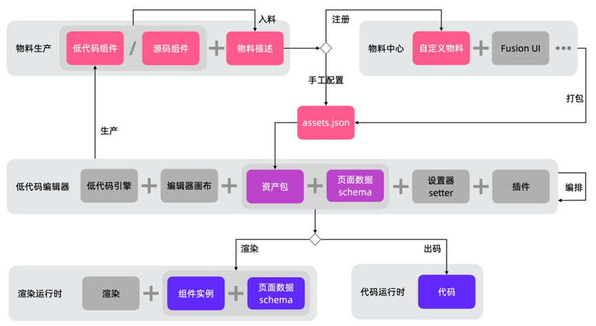

# 2025.2.19 火烧云

1、为什么换工作
2、低代码整体架构是什么样

主要分为两大块，编辑器、渲染运行时、物料中心。

编辑器：提供给用户一个可视化编辑组件的界面。 
渲染运行时：将页面 schema 和组件实例结合生成实际页面。 
物料中心：用于配置组件库及其属性，并提供组件实例 

编辑态中这三者的关系： 
渲染运行时将物料中心的组件实例和页面 schema 组合生成一个页面，编辑器给这个页面上的组件绑定设置器 setter，提供给用户一个可视化配置界面。用户在编辑器上修改属性后，编辑器通知更新 schema ，然后渲染运行时又会重新进行页面渲染。

运行态： 
渲染运行时将 schema 和组件实例进行组合生成页面。

3、为什么不考虑使用 AI 辅助开发呢？
4、现在的页面打开速度大约在 1.3s，如果我要你优化到 600ms，你有什么解决方法？
性能优化：

网络优化：

1. 使用缓存策略
2. 启用压缩
3. 使用 CDN
4. 使用 HTTP/2
5. preload 资源预加载

js 运行层面:

1. 优化 DOM 结构
2. Web Worker 开启多线程将渲染非必须的步骤交给异步执行
3. 资源按需加载

5、你觉得你在团队中的定位是什么？

6、你觉得你和那些资深前端开发工程师的差距在哪？

